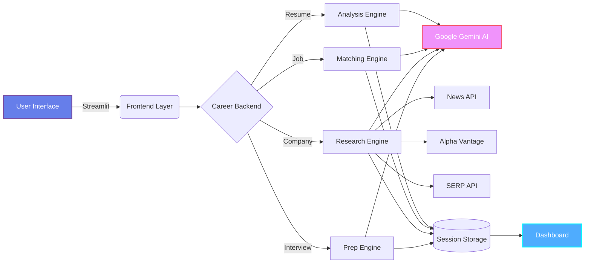

<div align="center">

# ⚡ NextRole AI

### AI-Powered Career Intelligence Platform

Transform your job search with intelligent automation and data-driven insights

[](https://www.python.org)
[](https://streamlit.io)
[](https://ai.google.dev)
[](LICENSE)

[🚀 Live Demo](https://nextrole-ai.streamlit.app/) • [📖 Documentation](#documentation) • [🤝 Contributing](#contributing)

</div>

---

## 🎯 Overview

**NextRole AI** is an intelligent career optimization platform that leverages advanced AI to provide personalized career insights, resume analysis, and interview preparation. Built for modern job seekers who demand data-driven decision making.

### Why NextRole AI?

```
Traditional Job Search          →          NextRole AI Approach
─────────────────────────────────────────────────────────────────
📄 Generic resume advice        →    🤖 AI-powered personalized analysis
🔍 Manual company research      →    📊 Automated multi-source intelligence  
❓ Guessing interview questions →    🎯 AI-generated role-specific prep
📝 Scattered preparation        →    💼 Unified career dashboard
```

---

## ✨ Key Features

<table>
<tr>
<td width="50%">

### 🎨 Professional Interface
- Modern glassmorphism design
- Dark theme optimized for extended use
- Responsive across all devices
- Intuitive navigation system

</td>
<td width="50%">

### 🧠 AI-Powered Analysis
- Google Gemini 2.5 Flash integration
- LangChain orchestration
- Context-aware recommendations
- Natural language processing

</td>
</tr>
<tr>
<td width="50%">

### 📊 Smart Analytics
- ATS compatibility scoring
- Skill gap analysis
- Job matching algorithms
- Performance metrics tracking

</td>
<td width="50%">

### 🔗 API Integrations
- Real-time company news (News API)
- Financial data (Alpha Vantage)
- Job market insights (Adzuna)
- Enhanced search (SERP API)

</td>
</tr>
</table>

---

## 🏗️ Architecture



### Technology Stack

| Layer | Technology | Purpose |
|-------|------------|---------|
| **Frontend** | Streamlit 1.28+ | Interactive web interface |
| **AI Engine** | Google Gemini 2.5 | Natural language processing |
| **Orchestration** | LangChain | AI workflow management |
| **APIs** | Multi-source | Real-time data aggregation |
| **Storage** | Session State | Persistent user data |
| **Processing** | PyPDF2, pdfplumber | Document parsing |

---

## 🚀 Quick Start

### Installation in 3 Steps

#### Step 1: Clone & Navigate
```bash
git clone https://github.com/KshitizCodeHub/NextRole-AI.git
cd NextRole-AI
```

#### Step 2: Install Dependencies
```bash
pip install -r requirements.txt
```

Required packages:
- `streamlit>=1.28.0` - Web framework
- `google-generativeai>=0.3.2` - AI engine
- `langchain-google-genai>=0.1.0` - AI orchestration
- `PyPDF2>=3.0.0` - PDF processing
- Additional utilities for enhanced features

#### Step 3: Configure API Keys
Create a `.env` file in the project root:

```env
# Required - AI Analysis
GOOGLE_API_KEY=your_gemini_api_key_here

# Optional - Enhanced Features
NEWS_API_KEY=your_news_api_key_here
ADZUNA_APP_ID=your_adzuna_app_id_here
ADZUNA_API_KEY=your_adzuna_api_key_here
ALPHA_VANTAGE_API_KEY=your_alpha_vantage_key_here
SERP_API_KEY=your_serp_api_key_here
```

### Launch Application

```bash
streamlit run career_frontend.py
```

Open your browser to **http://localhost:8501**

> 💡 **Tip**: Only `GOOGLE_API_KEY` is required for core functionality. Other APIs enhance the experience with real-time data.

---

## 💼 Platform Capabilities

### 1️⃣ Resume Analyzer
Intelligent resume optimization with AI-powered feedback

**Features:**
- 📄 PDF and text upload support
- 🎯 ATS compatibility scoring
- 💡 Actionable improvement suggestions
- 📊 Skills extraction and analysis
- ✅ Issue identification and fixes

**Output Example:**
```
ATS Score: 85/100
Skills Found: 12 technical + 8 soft skills
Issues: 3 formatting, 2 content gaps
Recommendations: Action verbs, quantifiable achievements
```

### 2️⃣ Job Matcher
Smart compatibility analysis between your profile and job requirements

**Features:**
- 🎯 Compatibility percentage scoring
- 📈 Skill gap identification
- 🔍 Requirement matching analysis
- 💼 Personalized improvement roadmap
- 📊 Side-by-side comparison

**Output Example:**
```
Compatibility: 92/100
Matching Skills: Python, React, AWS, CI/CD
Gap Areas: Kubernetes, System Design
Priority Actions: 3 recommendations
```

### 3️⃣ Company Research
Multi-source intelligence gathering for target companies

**Features:**
- 📰 Real-time news aggregation
- 💹 Financial performance data
- 🏢 Company insights and culture
- 🎯 Strategic talking points
- ⏱️ Automated research reports

**Data Sources:**
- News API → Latest company updates
- Alpha Vantage → Stock performance
- SERP API → Comprehensive web data
- Google Gemini → Intelligent synthesis

### 4️⃣ Interview Prep
AI-generated customized interview questions and preparation

**Features:**
- 🎤 Role-specific technical questions
- 💬 Behavioral question sets
- 🏢 Company-specific scenarios
- 📝 Answer frameworks
- ✨ Practice recommendations

**Question Types:**
- Technical (based on job requirements)
- Behavioral (STAR method ready)
- Company-specific (research-driven)
- Situational (role-focused)

### 5️⃣ Career Dashboard
Unified view of all career preparation activities

**Features:**
- 📊 Progress tracking across all modules
- 💾 Session persistence with timestamps
- 🔍 Debug and data management
- 📈 Comprehensive overview
- 🎯 Completion status indicators

---

## 📁 Project Structure

```
NextRole_AI/
│
├── 📄 career_frontend.py          # Streamlit UI with modular navigation
├── 🧠 career_backend_simple.py    # AI logic & API orchestration  
├── 🔧 advanced_tools.py           # Real-time data integration tools
├── 📋 requirements.txt            # Python dependencies (100+ packages)
├── 🔐 .env                        # API keys configuration (git-ignored)
├── 📖 README.md                   # This file
└── 📜 LICENSE                     # MIT License
```

### Component Breakdown

| File | Lines | Purpose | Key Dependencies |
|------|-------|---------|------------------|
| `career_frontend.py` | ~1200 | Main UI, routing, session state | `streamlit`, `google-generativeai` |
| `career_backend_simple.py` | ~800 | Core AI logic, API calls | `langchain`, `pypdf2`, `requests` |
| `advanced_tools.py` | ~400 | External API integrations | `newsapi`, `alpha_vantage`, `serpapi` |

---

## ⚙️ Configuration Guide

### Step 1: Clone Repository
```bash
git clone https://github.com/KshitizCodeHub/NextRole-AI.git
cd NextRole-AI
```

### Step 2: Environment Setup
```bash
# Create virtual environment
python -m venv venv

# Activate environment
# Windows:
venv\Scripts\activate
# Mac/Linux:
source venv/bin/activate

# Install dependencies
pip install -r requirements.txt
```

### Step 3: API Configuration

Create `.env` file:
```env
# Required - Core AI Functionality
GOOGLE_API_KEY=your_gemini_api_key_here

# Optional - Enhanced Features (Company Research)
NEWS_API_KEY=your_news_api_key_here
ALPHA_VANTAGE_API_KEY=your_alpha_vantage_key_here
SERP_API_KEY=your_serp_api_key_here
ADZUNA_APP_ID=your_adzuna_app_id_here
ADZUNA_API_KEY=your_adzuna_api_key_here
```

**API Provider Reference:**

| Service | Purpose | Free Limit | Sign Up |
|---------|---------|------------|---------|
| Google AI Studio | AI analysis engine | ✅ Unlimited | [Get Key](https://makersuite.google.com/app/apikey) |
| News API | Company updates | 100/day | [Sign Up](https://newsapi.org/) |
| Alpha Vantage | Stock data | 5/min | [Sign Up](https://www.alphavantage.co/) |
| SERP API | Enhanced search | 100/month | [Sign Up](https://serpapi.com/) |
| Adzuna | Job market data | 1000/month | [Sign Up](https://developer.adzuna.com/) |

### Step 4: Launch Application

```bash
streamlit run career_frontend.py
```

**Default URL:** `http://localhost:8501`

> 💡 **Quick Tip:** Verify your config with:
> ```bash
> python -c "from dotenv import load_dotenv; import os; load_dotenv(); print('✅ Ready!' if os.getenv('GOOGLE_API_KEY') else '❌ Add API key')"
> ```

---

## 🤝 Contributing

We welcome contributions from the community! Here's how you can help:

### Contribution Areas

| Area | Description | Difficulty |
|------|-------------|------------|
| 🎨 **UI/UX** | Streamlit components, themes, layouts | ⭐ Easy |
| 🔌 **API Integrations** | Add new data sources (LinkedIn, Indeed, etc.) | ⭐⭐ Medium |
| 🧠 **AI Features** | Enhance prompts, add new analysis types | ⭐⭐⭐ Advanced |
| 📖 **Documentation** | Improve guides, add examples | ⭐ Easy |
| 🐛 **Bug Fixes** | Fix issues, improve error handling | ⭐⭐ Medium |

### Quick Start for Contributors

```bash
# 1. Fork the repository
# 2. Clone your fork
git clone https://github.com/YOUR_USERNAME/NextRole-AI.git

# 3. Create a feature branch
git checkout -b feature/your-feature-name

# 4. Make changes and test
streamlit run career_frontend.py

# 5. Commit with descriptive message
git commit -m "Add: Description of your feature"

# 6. Push and create Pull Request
git push origin feature/your-feature-name
```

### Code Standards
- ✅ Follow PEP 8 for Python code
- ✅ Add docstrings to new functions
- ✅ Test all API integrations
- ✅ Update README if adding features

---

## 📄 License

This project is licensed under the **MIT License**.

**What this means:**
- ✅ Use for commercial projects
- ✅ Modify and distribute
- ✅ Private use
- ⚠️ Include original license in copies

See the [LICENSE](LICENSE) file for full details.

---

## 💬 Support & Community

### Get Help

| Channel | Purpose | Response Time |
|---------|---------|---------------|
| 🐛 [GitHub Issues](https://github.com/KshitizCodeHub/NextRole-AI/issues) | Bug reports, feature requests | 24-48 hours |
| 💭 [Discussions](https://github.com/KshitizCodeHub/NextRole-AI/discussions) | Questions, ideas, showcase | Community-driven |
| 📧 Email | Private inquiries | 48-72 hours |

### Common Issues

<details>
<summary><b>❌ "Failed to generate content" error</b></summary>

**Solution:**
- Verify `GOOGLE_API_KEY` in `.env` file
- Check API quota at [Google AI Studio](https://makersuite.google.com/)
- Ensure internet connection is active
</details>

<details>
<summary><b>❌ Company research not working</b></summary>

**Solution:**
- Add optional API keys (`NEWS_API_KEY`, etc.)
- Check API rate limits
- Verify company name spelling
</details>

<details>
<summary><b>❌ Resume upload fails</b></summary>

**Solution:**
- Ensure PDF is not password-protected
- Check file size (< 10MB recommended)
- Try converting to plain text format
</details>

---

## 🙏 Acknowledgments

Special thanks to the following projects and services:

| Technology | Role | Why We Love It |
|------------|------|----------------|
| **Google Gemini 2.5** | AI brain | Powerful, free, developer-friendly |
| **Streamlit** | Web framework | Rapid prototyping, Python-native |
| **LangChain** | AI orchestration | Simplified prompt engineering |
| **News API** | Company data | Real-time news aggregation |
| **Alpha Vantage** | Financial data | Comprehensive stock insights |

### Built With ❤️ By

**Kshitiz** - [GitHub Profile](https://github.com/KshitizCodeHub)

*Inspired by the challenges faced during placement season. Built to help students land their dream jobs.*

---

<div align="center">

### 🚀 Ready to Transform Your Career?

[](https://nextrole-ai.streamlit.app/)
[](https://github.com/KshitizCodeHub/NextRole-AI)
[](https://github.com/KshitizCodeHub/NextRole-AI/fork)

---

**NextRole AI** © 2024 | Licensed under MIT | Made with Python 🐍 & AI ⚡

*"Your next role is just an AI analysis away"*

</div>