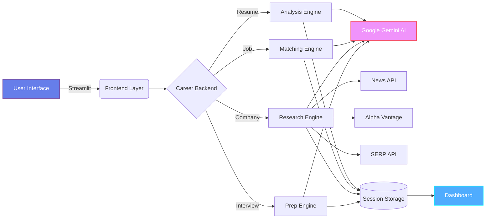

<div align="center">

# NextRole AI

### AI-Powered Career Intelligence Platform

[](https://www.python.org)
[](https://streamlit.io)
[](https://ai.google.dev)
[](LICENSE)

[Live Demo](https://next-role-ai.streamlit.app/) • [Documentation](#documentation) • [Contributing](#contributing)

</div>

---

## Overview

**NextRole AI** is an intelligent career optimization platform leveraging AI to provide personalized career insights, resume analysis, and interview preparation.

---

## Key Features

- **Professional Interface** - Modern design with dark theme
- **AI-Powered Analysis** - Google Gemini 2.5 Flash integration with LangChain
- **Smart Analytics** - ATS scoring, skill gap analysis, job matching
- **API Integrations** - News API, Alpha Vantage, Adzuna, SERP API

---

## Architecture



### Technology Stack

| Layer | Technology | Purpose |
|-------|------------|---------|
| **Frontend** | Streamlit 1.28+ | Interactive web interface |
| **AI Engine** | Google Gemini 2.5 | Natural language processing |
| **Orchestration** | LangChain | AI workflow management |
| **APIs** | Multi-source | Real-time data aggregation |
| **Storage** | Session State | Persistent user data |
| **Processing** | PyPDF2, pdfplumber | Document parsing |

---

## Quick Start

```bash
# Clone repository
git clone https://github.com/NamanKundan/NextRole_AI.git
cd NextRole_AI

# Install dependencies
pip install -r requirements.txt

# Create .env file with API keys
GOOGLE_API_KEY=your_gemini_api_key_here

# Run application
streamlit run career_frontend.py
```

Open **http://localhost:8501** in your browser.

> Note: Only GOOGLE_API_KEY is required. Optional: NEWS_API_KEY, ALPHA_VANTAGE_API_KEY, SERP_API_KEY, ADZUNA_API_KEY

---

## Platform Capabilities

### Resume Analyzer
- PDF and text upload support
- ATS compatibility scoring
- Skills extraction and analysis
- Actionable improvement suggestions

### Job Matcher
- Compatibility percentage scoring
- Skill gap identification
- Personalized improvement roadmap

### Company Research
- Real-time news aggregation (News API)
- Financial performance data (Alpha Vantage)
- Comprehensive web data (SERP API)
- AI-powered synthesis (Google Gemini)

### Interview Prep
- Role-specific technical questions
- Behavioral question sets (STAR method)
- Company-specific scenarios

### Career Dashboard
- Progress tracking across all modules
- Session persistence with timestamps
- Comprehensive overview

---

## Project Structure

```
NextRole_AI/
├── career_frontend.py          # Streamlit UI
├── career_backend_simple.py    # AI logic & API orchestration
├── advanced_tools.py           # Real-time data integration
├── requirements.txt            # Python dependencies
├── .env                        # API keys configuration
└── LICENSE                     # MIT License
```

---

## Configuration

### API Keys

| Service | Purpose | Get Key |
|---------|---------|------|
| Google AI Studio | AI analysis (Required) | [Get Key](https://makersuite.google.com/app/apikey) |
| News API | Company updates (Optional) | [Sign Up](https://newsapi.org/) |
| Alpha Vantage | Stock data (Optional) | [Sign Up](https://www.alphavantage.co/) |
| SERP API | Enhanced search (Optional) | [Sign Up](https://serpapi.com/) |
| Adzuna | Job market data (Optional) | [Sign Up](https://developer.adzuna.com/) |

---

## Contributing

Contributions are welcome! Fork the repository, create a feature branch, and submit a pull request.

**Areas:** UI/UX improvements, API integrations, AI features, documentation, bug fixes

**Standards:** Follow PEP 8, add docstrings, test integrations

---

## License

MIT License - see [LICENSE](LICENSE) file for details.

---

## Support

- **Issues:** [GitHub Issues](https://github.com/NamanKundan/NextRole_AI/issues)
- **Discussions:** [GitHub Discussions](https://github.com/NamanKundan/NextRole_AI/discussions)

---

## Acknowledgments

Built with: Google Gemini 2.5, Streamlit, LangChain, News API, Alpha Vantage

**Created by:** [Naman](https://github.com/NamanKundan)

---

<div align="center">

**NextRole AI** © 2024 | MIT License

[Live Demo](https://next-role-ai.streamlit.app/) • [GitHub](https://github.com/NamanKundan/NextRole_AI)

</div>